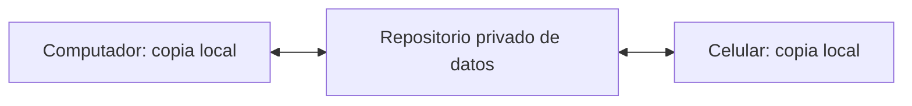

# Bitácora Fellow

### Tu experiencia en cirugía de rodilla, caso a caso.

Registra los procedimientos en los que participas durante el fellowship, consulta tu actividad y revisa cuánto te falta para alcanzar tus metas. Puedes usarla desde el computador o el celular.

**[Abrir la app](https://franciscofs.github.io/bitacora-fellow/)** · [Probar con casos ficticios](https://franciscofs.github.io/bitacora-fellow/?demo=1) · [Guía de uso](docs/guia-de-uso.md)

La demostración usa una bitácora independiente: no modifica tus registros ni se conecta a GitHub.

## Del caso al progreso

| Qué necesitas | Dónde hacerlo |
| --- | --- |
| Registrar una cirugía recién terminada | **Nuevo caso**: procedimiento, diagnóstico y tu rol. El borrador se guarda automáticamente. |
| Encontrar o corregir un registro | **Bitácora**: busca, ordena y abre la ficha para editarla. |
| Revisar tu actividad | **Dashboard**: filtra por período y consulta los indicadores y gráficos. |
| Seguir tus metas | Define objetivos por procedimiento o combina varios en una misma meta. Cada caso cuenta una sola vez en el grupo. |
| Llevarte tus datos | **Ajustes**: exporta a Excel (CSV) o guarda un respaldo JSON. |

Las metas muestran tu experiencia acumulada y no cambian al filtrar el dashboard. Puedes contar toda participación o solo los casos en los que actuaste como cirujano.

## Empieza con un caso

1. [Abre la app](https://franciscofs.github.io/bitacora-fellow/) y entra a **Nuevo caso**.
2. Completa los campos esenciales y agrega los detalles que necesites.
3. Guarda el caso. Lo encontrarás en **Bitácora** y en los indicadores del **Dashboard**.

Puedes empezar sin configurar GitHub. Los registros quedan en ese navegador; exporta un respaldo JSON desde **Ajustes** para conservar una copia.

## Tu bitácora en varios dispositivos

La sincronización es opcional. Conecta un repositorio privado de GitHub para compartir tus registros entre dispositivos.



Necesitas un token de GitHub limitado al repositorio de datos, con permiso **Contents: Read and write**. Configúralo en **Ajustes → Sincronización** en cada dispositivo. Puedes activar la sincronización automática al guardar o usar **Sincronizar ahora**.

[Configurar la sincronización paso a paso](docs/guia-de-uso.md#3-conectar-la-base-de-datos-una-sola-vez)

> El repositorio de esta app es público. Guarda los respaldos y planillas en tu computador o en tu repositorio privado de datos. Evita nombres, RUT y números de ficha de pacientes. El respaldo JSON no incluye el token.

## Ejecutarla en tu computador

HTML, CSS y JavaScript puro. No necesita un proceso de build ni paquetes de npm.

Desde la carpeta del proyecto, inicia un servidor local con Python:

```powershell
python -m http.server 8765
```

Abre <http://localhost:8765/>. También puedes abrir `index.html` directamente, aunque algunos navegadores bloquean la conexión con GitHub desde `file://`.

## Guías y desarrollo

| Buscas… | Consulta |
| --- | --- |
| Publicar tu propia copia | [GitHub Pages](docs/guia-de-uso.md#2-publicarla-en-github-pages) |
| Exportar, importar o migrar una planilla anterior | [Respaldos y migración](docs/guia-de-uso.md#exportar-e-importar) |
| Resolver un problema de conexión o caché | [Problemas frecuentes](docs/guia-de-uso.md#7-problemas-frecuentes) |
| Encontrar los módulos del proyecto | [Estructura del código](docs/guia-de-uso.md#6-estructura-del-proyecto) |
| Adaptar procedimientos, campos o metas iniciales | [Personalización](docs/guia-de-uso.md#9-personalizar) |
| Entender la interfaz y sus criterios | [Implementación UI/UX](docs/implementacion-ui-ux.md) · [Paleta institucional](docs/paleta-institucional.md) |

Para validar cambios en la app, ejecuta las pruebas de regresión con Node.js:

```powershell
node --test tests/regression.test.cjs
```

Cubren fechas, métricas, importación, respaldos y conflictos de sincronización con datos ficticios y una API de GitHub simulada.
