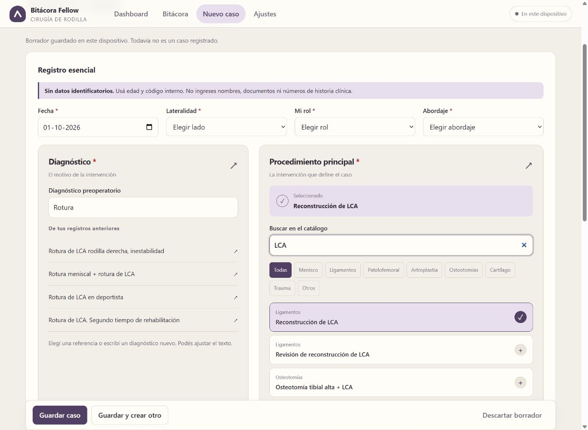
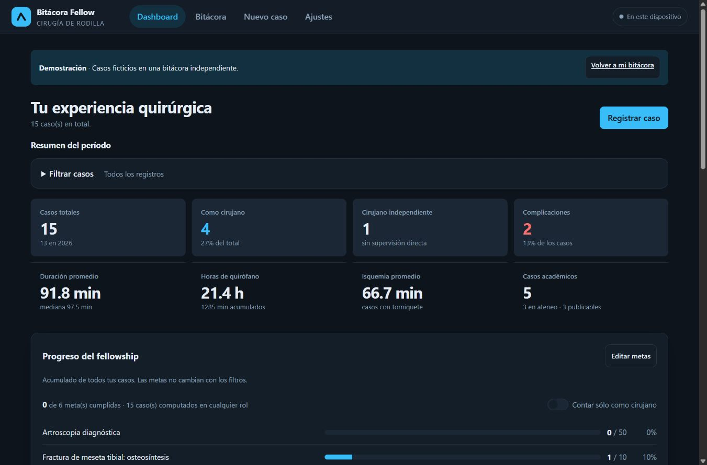
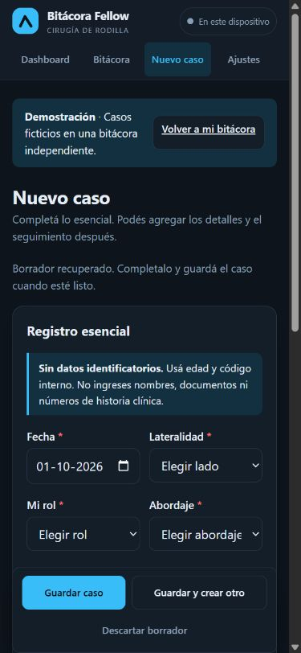

# Implementación UI/UX

Cambios locales aplicados el 1 de octubre de 2026 a partir de la auditoría y de la dirección visual revisada con gpt-taste. Se conserva la arquitectura estática, sin dependencias externas.

## Cambios

- Navegación con cuatro destinos visibles en móvil, cabecera fija, marca renovada, jerarquía tipográfica y botones con contraste en ambos temas. Selector claro, oscuro o automático.
- Dashboard con indicadores en una cuadrícula regular, filtros plegables, estados vacíos y gráficos con etiquetas HTML legibles y tablas completas de valores.
- Metas con lectura y edición separadas, orden estable y alcance global explícito.
- Registro con seis campos esenciales, cinco secciones opcionales, procedimientos buscables, campos condicionales, errores por campo y acciones de guardado persistentes.
- Borrador automático recuperable al recargar; confirmación antes de descartarlo. Edición conserva código, datos y seguimiento; acceso directo para agregar seguimiento desde la ficha.
- Bitácora como lista de procedimientos en móvil, tabla en escritorio y exportación de los resultados visibles.
- Ajustes separados por tarea, estados precisos de guardado y sincronización, aviso de fallo de almacenamiento y respaldo de emergencia.
- Importación validada con fusión, reemplazo y cancelación independientes. Reemplazo y borrado requieren confirmación escrita y explican el alcance remoto.
- Demo independiente de los registros del usuario, sin conexión a GitHub. Respaldos incluyen metas, criterio de conteo y borrador pendiente, sin credenciales.
- Fecha local, mediana real, conteo académico sin duplicar casos y promedio de isquemia restringido a casos con torniquete.
- Sincronización con marcas de eliminación, reintento de reemplazos y protección de cambios realizados durante una subida.

## Validación

### Segunda pasada visual

Paleta marfil/ciruela en tema claro y ciruela/lima en oscuro; titulares editoriales. Diagnóstico con referencias de los registros anteriores y texto editable. Procedimiento principal con búsqueda, filtros por área y selección destacada. Procedimientos asociados en un panel visible, con selección múltiple y etiquetas removibles. Se conserva el catálogo clínico existente y el formato de datos.

Se comprobó selección de LCA, agregado de reparación meniscal, elección de un diagnóstico previo y guardado del caso ficticio en la demo independiente. La página conserva su ancho en móvil y la consola no registra errores de la app.

`node --test tests/regression.test.cjs`: **12 pruebas aprobadas**. Comprobación de sintaxis de todos los archivos JavaScript sin errores.

Prueba manual en Chrome a 1366 × 900 y 390 × 844 con datos ficticios: creación, edición, seguimiento, recuperación del borrador, cancelación de descarte, campos condicionales, resultados vacíos, edición de metas, temas y ficha móvil. Sin desbordamiento horizontal de página ni errores de consola de la app.

Las pruebas de GitHub usan respuestas simuladas, incluidos conflictos de versión. No se verificó contra un repositorio remoto ni se publicó la aplicación. El tiempo de registro y la utilidad clínica deben validarse con usuarios.

